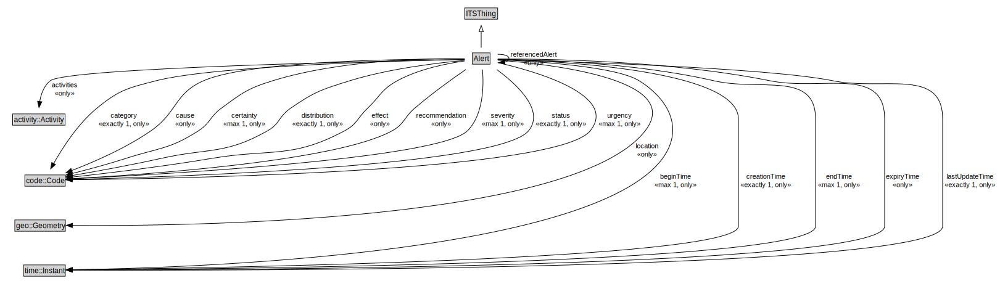

# Alert

An Alert can be used to notify people of important information.

<a href="../../diagrams/transportnetwork__Alert.dot.svg">Open interactive Alert diagram</a>

## Specializations of Alert

| Class | Description |
|-------|-------------|
| [Transport Alert](transportnetwork__TransportAlert.md) | A TransportAlert is a type of alert that can be used to notify people of important transport information. |

## Formalization for Alert

| Property | Constraint |
|----------|------------|
| activities | all activity::Activity |
| beginTime | all time::Instant |
| beginTime | max 1 owl::Thing |
| category | all code::Code |
| category | exactly 1 owl::Thing |
| cause | all code::Code |
| certainty | all code::Code |
| certainty | max 1 owl::Thing |
| creationTime | all time::Instant |
| creationTime | exactly 1 owl::Thing |
| distribution | all code::Code |
| distribution | exactly 1 owl::Thing |
| effect | all code::Code |
| endTime | all time::Instant |
| endTime | max 1 owl::Thing |
| expiryTime | all time::Instant |
| genProp::hasDescription | all xsd::string |
| genProp::hasDescription | exactly 1 owl::Thing |
| headline | all xsd::string |
| headline | exactly 1 owl::Thing |
| issuer | all xsd::nonNegativeInteger |
| issuer | exactly 1 owl::Thing |
| lastUpdateTime | all time::Instant |
| lastUpdateTime | exactly 1 owl::Thing |
| location | all geo::Geometry |
| recommendation | all code::Code |
| referencedAlert | all Alert |
| resources | all xsd::anyURI |
| severity | all code::Code |
| severity | max 1 owl::Thing |
| status | all code::Code |
| status | exactly 1 owl::Thing |
| subClassOf | ITSThing |
| urgency | all code::Code |
| urgency | max 1 owl::Thing |
| website | all xsd::anyURI |

## Used by classes

| Class | Property |
|-------|----------|
| [Alert](transportnetwork__Alert.md) | referencedAlert |

## Other annotations

| Annotation | Value |
|------------|-------|
| xsd::pattern | TransportAlertPattern |

