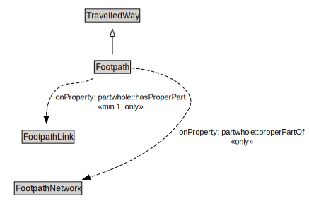

# Footpath

A Footpath is a type of TravelledWay that is made up of FootpathLinks.

<a href="../../diagrams/transportnetwork__Footpath.dot.svg">Open interactive Footpath diagram</a>

## Formalization for Footpath

| Property | Constraint |
|----------|------------|
| partwhole::hasProperPart | all FootpathLink |
| partwhole::hasProperPart | min 1 owl::Thing |
| partwhole::properPartOf | all FootpathNetwork |
| subClassOf | TravelledWay |

## Other annotations

| Annotation | Value |
|------------|-------|
| xsd::pattern | PedestrianNetworkPattern |

