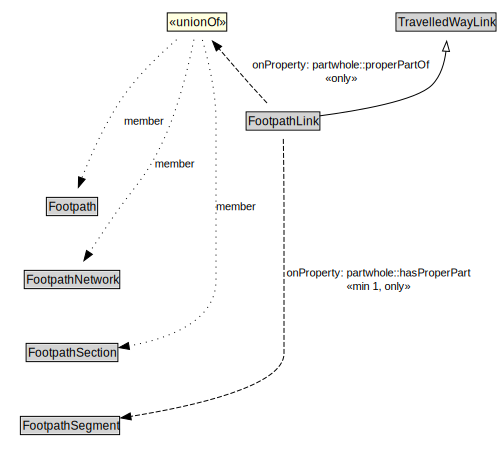

# FootpathLink

A Footpath Link is a type of TravelledWayLink designed for pedestrians.

<a href="../../diagrams/transportnetwork__FootpathLink.dot.svg">Open interactive FootpathLink diagram</a>

## Formalization for FootpathLink

| Property | Constraint |
|----------|------------|
| partwhole::hasProperPart | all FootpathSegment |
| partwhole::hasProperPart | min 1 owl::Thing |
| partwhole::properPartOf | all Footpath or FootpathNetwork or FootpathSection |
| subClassOf | TravelledWayLink |

## Used by classes

| Class | Property |
|-------|----------|
| [Footpath](transportnetwork__Footpath.md) | partwhole::hasProperPart |

## Other annotations

| Annotation | Value |
|------------|-------|
| xsd::pattern | PedestrianNetworkPattern |

