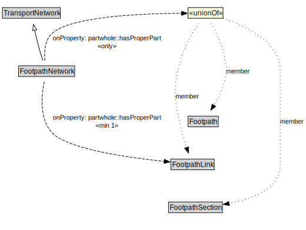

# FootpathNetwork

A FootpathNetwork is a type of TransportNetwork designed for the use of pedestrians but may be used by others as well.

<a href="../../diagrams/transportnetwork__FootpathNetwork.dot.svg">Open interactive FootpathNetwork diagram</a>

## Formalization for FootpathNetwork

| Property | Constraint |
|----------|------------|
| partwhole::hasProperPart | all Footpath or FootpathLink or FootpathSection |
| partwhole::hasProperPart | min 1 owl::Thing |
| subClassOf | TransportNetwork |

## Used by classes

| Class | Property |
|-------|----------|
| [Footpath](transportnetwork__Footpath.md) | partwhole::properPartOf |
| [Footpath Section](transportnetwork__FootpathSection.md) | partwhole::properPartOf |

## Other annotations

| Annotation | Value |
|------------|-------|
| xsd::pattern | PedestrianNetworkPattern |

