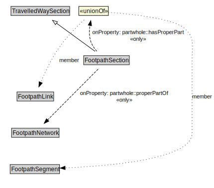

# FootpathSection

A FootpathSection is a type of TravelledWaySection that groups FootpathLinks and FootpathSegments for a useful operational purpose.

<a href="../../diagrams/transportnetwork__FootpathSection.dot.svg">Open interactive FootpathSection diagram</a>

## Formalization for FootpathSection

| Property | Constraint |
|----------|------------|
| partwhole::hasProperPart | all FootpathLink or FootpathSegment |
| partwhole::properPartOf | all FootpathNetwork |
| subClassOf | TravelledWaySection |

## Other annotations

| Annotation | Value |
|------------|-------|
| xsd::pattern | PedestrianNetworkPattern |

