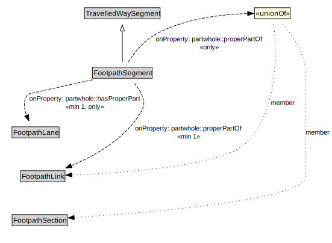

# FootpathSegment

A FootpathSegment is a type of TravelledWaySegment that represents a portion of a FootpathLink with common physical characteristics.

<a href="../../diagrams/transportnetwork__FootpathSegment.dot.svg">Open interactive FootpathSegment diagram</a>

## Formalization for FootpathSegment

| Property | Constraint |
|----------|------------|
| partwhole::hasProperPart | all FootpathLane |
| partwhole::hasProperPart | min 1 owl::Thing |
| partwhole::properPartOf | all FootpathLink or FootpathSection |
| partwhole::properPartOf | min 1 owl::Thing |
| subClassOf | TravelledWaySegment |

## Used by classes

| Class | Property |
|-------|----------|
| [Footpath Lane](transportnetwork__FootpathLane.md) | partwhole::properPartOf |
| [Footpath Link](transportnetwork__FootpathLink.md) | partwhole::hasProperPart |

## Other annotations

| Annotation | Value |
|------------|-------|
| xsd::pattern | PedestrianNetworkPattern |

