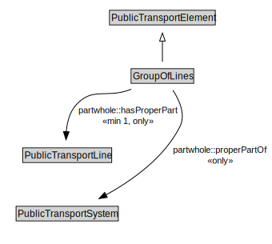

# GroupOfLines

A GroupOfLines is a logical grouping of PublicTransportLines for any useful purpose.

<a href="../../diagrams/transportnetwork__GroupOfLines.dot.svg">Open interactive GroupOfLines diagram</a>

## Formalization for GroupOfLines

| Property | Constraint |
|----------|------------|
| partwhole::hasProperPart | all PublicTransportLine |
| partwhole::hasProperPart | min 1 owl::Thing |
| partwhole::properPartOf | all PublicTransportSystem |
| subClassOf | PublicTransportElement |

## Other annotations

| Annotation | Value |
|------------|-------|
| xsd::pattern | PublicTransportSystemPattern |

