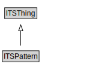

# ITSPattern

<a href="../../diagrams/transportnetwork__ITSPattern.dot.svg">Open interactive ITSPattern diagram</a>

## Specializations of ITSPattern

| Class | Description |
|-------|-------------|
| [Micromobility Network Pattern (transportnetwork)](transportnetwork__MicromobilityNetworkPattern.md) | The micromobility network pattern specializes the road network pattern to address the needs for the travel of micromobility vehicles. |
| [Pedestrian Network Pattern (transportnetwork)](transportnetwork__PedestrianNetworkPattern.md) | The pedestrian network pattern specializes the transport network pattern to address the needs for pedestrian travel. |
| [Public Transport System Pattern (transportnetwork)](transportnetwork__PublicTransportSystemPattern.md) | The public transport system pattern specializes the transport network pattern to address the needs for public transport travel. Whereas the transport network pattern focuses on infrastructure, the public transport system pattern focuses on the operations that rely on the infrastructure provided by the transport networks. |
| [Rail Network Pattern (transportnetwork)](transportnetwork__RailNetworkPattern.md) | The rail network pattern specializes the transport network pattern to address the needs for travel of rail vehicles (e.g., trains, subways, trams). |
| [Road Network Pattern (transportnetwork)](transportnetwork__RoadNetworkPattern.md) | The road network pattern specializes the transport network pattern to address the needs for vehicular travel. Road networks that are primarily designed for the movement of micromobility vehicles should generally be defined using the micromobility network pattern, which is a specialization of this pattern. |
| [Transport Alert Pattern (transportnetwork)](transportnetwork__TransportAlertPattern.md) | The transport alert pattern addresses the need for public agencies to alert groups to unusual transport-related conditions. Most of the features of the transport alert pattern can also be used for other types of alerts (e.g., meteorological events) and as such, its design includes the definition of a generalized alert. |
| [Transport Network Pattern (transportnetwork)](transportnetwork__TransportNetworkPattern.md) | The Transport Network Pattern models the core concepts involved in describing a transport network. This includes an identification of both physical and administrative characteristics. The most general class is that of the NetworkElement, which can be further classified as one of several types of NetworkElements.

A key feature of this pattern is the formalization of the hasProperPart relationship from a NetworkElement to another NetworkElement. This allows for a representation of networks at multiple levels of detail. For example, at one level, a motorway interchange can be modelled as a single Node. But that node is a NetworkElement that can be defined to consist of an entire TransportNetwork that has a node for each junction within the interchange. |
| [Travel Corridor Pattern (transportnetwork)](transportnetwork__TravelCorridorPattern.md) | The travel corridor pattern specializes the transport network pattern to address the needs for a more holistic travel view. |

## Formalization for ITSPattern

| Property | Constraint |
|----------|------------|
| subClassOf | ITSThing |

