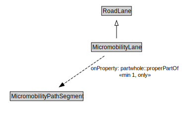

# MicromobilityLane

A MicromobilityLane is a type of RoadLane that forms part of a MicromobilityPathSegment.

<a href="../../diagrams/transportnetwork__MicromobilityLane.dot.svg">Open interactive MicromobilityLane diagram</a>

## Formalization for MicromobilityLane

| Property | Constraint |
|----------|------------|
| partwhole::properPartOf | all MicromobilityPathSegment |
| partwhole::properPartOf | min 1 owl::Thing |
| subClassOf | RoadLane |

## Used by classes

| Class | Property |
|-------|----------|
| [Micromobility Path Segment](transportnetwork__MicromobilityPathSegment.md) | partwhole::hasProperPart |

## Other annotations

| Annotation | Value |
|------------|-------|
| xsd::pattern | MicromobilityNetworkPattern |

