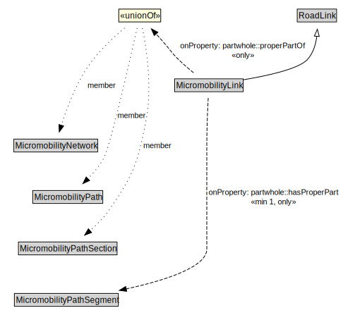

# MicromobilityLink

A MicromobilityLink is a type of RoadLink designed for micromobility vehicles.

<a href="../../diagrams/transportnetwork__MicromobilityLink.dot.svg">Open interactive MicromobilityLink diagram</a>

## Formalization for MicromobilityLink

| Property | Constraint |
|----------|------------|
| partwhole::hasProperPart | all MicromobilityPathSegment |
| partwhole::hasProperPart | min 1 owl::Thing |
| partwhole::properPartOf | all MicromobilityNetwork or MicromobilityPath or MicromobilityPathSection |
| subClassOf | RoadLink |

## Used by classes

| Class | Property |
|-------|----------|
| [Micromobility Path](transportnetwork__MicromobilityPath.md) | partwhole::hasProperPart |

## Other annotations

| Annotation | Value |
|------------|-------|
| xsd::pattern | MicromobilityNetworkPattern |

