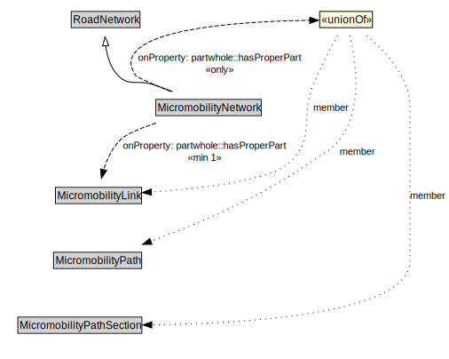

# MicromobilityNetwork

A MicromobilityNetwork is a type of RoadNetwork designed for the use of micromobility vehicles, which have more limited performance characteristics than motor vehicles.

<a href="../../diagrams/transportnetwork__MicromobilityNetwork.dot.svg">Open interactive MicromobilityNetwork diagram</a>

## Formalization for MicromobilityNetwork

| Property | Constraint |
|----------|------------|
| partwhole::hasProperPart | all MicromobilityLink or MicromobilityPath or MicromobilityPathSection |
| partwhole::hasProperPart | min 1 owl::Thing |
| subClassOf | RoadNetwork |

## Used by classes

| Class | Property |
|-------|----------|
| [Micromobility Path](transportnetwork__MicromobilityPath.md) | partwhole::properPartOf |
| [Micromobility Path Section](transportnetwork__MicromobilityPathSection.md) | partwhole::properPartOf |

## Other annotations

| Annotation | Value |
|------------|-------|
| xsd::pattern | MicromobilityNetworkPattern |

