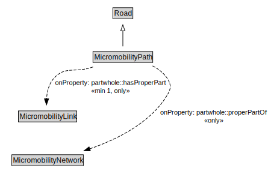

# MicromobilityPath

A MicromobilityPath is a type of Road that is made up of MicromobilityPathLinks.

<a href="../../diagrams/transportnetwork__MicromobilityPath.dot.svg">Open interactive MicromobilityPath diagram</a>

## Formalization for MicromobilityPath

| Property | Constraint |
|----------|------------|
| partwhole::hasProperPart | all MicromobilityLink |
| partwhole::hasProperPart | min 1 owl::Thing |
| partwhole::properPartOf | all MicromobilityNetwork |
| subClassOf | Road |

## Other annotations

| Annotation | Value |
|------------|-------|
| xsd::pattern | MicromobilityNetworkPattern |

