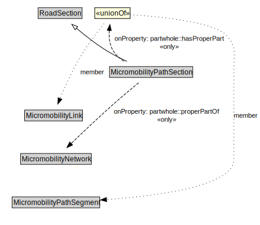

# MicromobilityPathSection

A MicromobilityPathSections is a type of RoadSection that groups MicromobilityLinks and MicromobilityPathSegments for a useful operational purpose (e.g., assigning a speed limit, designating areas of shared use).

<a href="../../diagrams/transportnetwork__MicromobilityPathSection.dot.svg">Open interactive MicromobilityPathSection diagram</a>

## Formalization for MicromobilityPathSection

| Property | Constraint |
|----------|------------|
| partwhole::hasProperPart | all MicromobilityLink or MicromobilityPathSegment |
| partwhole::properPartOf | all MicromobilityNetwork |
| subClassOf | RoadSection |

## Other annotations

| Annotation | Value |
|------------|-------|
| xsd::pattern | MicromobilityNetworkPattern |

