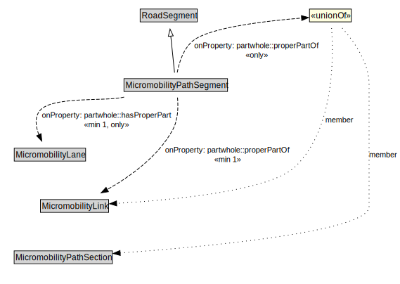

# MicromobilityPathSegment

A MicromobilityPathSegment is a type of RoadSegment that represents a portion of a MicromobilityLink with common physical characteristics.

<a href="../../diagrams/transportnetwork__MicromobilityPathSegment.dot.svg">Open interactive MicromobilityPathSegment diagram</a>

## Formalization for MicromobilityPathSegment

| Property | Constraint |
|----------|------------|
| partwhole::hasProperPart | all MicromobilityLane |
| partwhole::hasProperPart | min 1 owl::Thing |
| partwhole::properPartOf | all MicromobilityLink or MicromobilityPathSection |
| partwhole::properPartOf | min 1 owl::Thing |
| subClassOf | RoadSegment |

## Used by classes

| Class | Property |
|-------|----------|
| [Micromobility Lane](transportnetwork__MicromobilityLane.md) | partwhole::properPartOf |
| [Micromobility Link](transportnetwork__MicromobilityLink.md) | partwhole::hasProperPart |

## Other annotations

| Annotation | Value |
|------------|-------|
| xsd::pattern | MicromobilityNetworkPattern |

