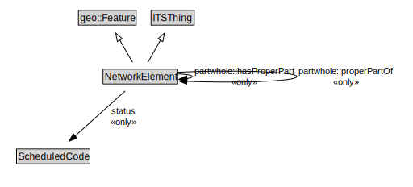

# NetworkElement

A NetworkElement represents any element of a transport network. It can be a part of another NetworkElement and can be decomposed into smaller NetworkElements.

<a href="../../diagrams/transportnetwork__NetworkElement.dot.svg">Open interactive NetworkElement diagram</a>

## Specializations of NetworkElement

| Class | Description |
|-------|-------------|
| [Footpath](transportnetwork__Footpath.md) | A Footpath is a type of TravelledWay that is made up of FootpathLinks. |
| [Footpath Lane](transportnetwork__FootpathLane.md) | A FootpathLane is a type of TravelledWayLane that forms part of a FootpathSegment. |
| [Footpath Link](transportnetwork__FootpathLink.md) | A Footpath Link is a type of TravelledWayLink designed for pedestrians. |
| [Footpath Network](transportnetwork__FootpathNetwork.md) | A FootpathNetwork is a type of TransportNetwork designed for the use of pedestrians but may be used by others as well. |
| [Footpath Section](transportnetwork__FootpathSection.md) | A FootpathSection is a type of TravelledWaySection that groups FootpathLinks and FootpathSegments for a useful operational purpose. |
| [Footpath Segment](transportnetwork__FootpathSegment.md) | A FootpathSegment is a type of TravelledWaySegment that represents a portion of a FootpathLink with common physical characteristics. |
| [Junction](transportnetwork__Junction.md) | A Junction is a TransportNode that allows a traveller to connect from one TravelledWayLink to another. |
| [Micromobility Lane](transportnetwork__MicromobilityLane.md) | A MicromobilityLane is a type of RoadLane that forms part of a MicromobilityPathSegment. |
| [Micromobility Link](transportnetwork__MicromobilityLink.md) | A MicromobilityLink is a type of RoadLink designed for micromobility vehicles. |
| [Micromobility Network](transportnetwork__MicromobilityNetwork.md) | A MicromobilityNetwork is a type of RoadNetwork designed for the use of micromobility vehicles, which have more limited performance characteristics than motor vehicles. |
| [Micromobility Path](transportnetwork__MicromobilityPath.md) | A MicromobilityPath is a type of Road that is made up of MicromobilityPathLinks. |
| [Micromobility Path Section](transportnetwork__MicromobilityPathSection.md) | A MicromobilityPathSections is a type of RoadSection that groups MicromobilityLinks and MicromobilityPathSegments for a useful operational purpose (e.g., assigning a speed limit, designating areas of shared use). |
| [Micromobility Path Segment](transportnetwork__MicromobilityPathSegment.md) | A MicromobilityPathSegment is a type of RoadSegment that represents a portion of a MicromobilityLink with common physical characteristics. |
| [Rail Corridor](transportnetwork__RailCorridor.md) | A RailCorridor is a type of TravelledWay that is made up of TrackLinks. |
| [Rail Network](transportnetwork__RailNetwork.md) | A RailNetwork is a type of TransportNetwork using rails on a stabilized base. |
| [Rail Section](transportnetwork__RailSection.md) | A RailSection is a type of TravelledWaySection that groups TrackLinks and TrackSegments for a useful operational purpose (e.g., assigning a speed limit, designating a traffic control scheme). |
| [Road](transportnetwork__Road.md) | A Road is a type of TravelledWay and transinfras:Road that is made up of RoadLinks. Roads form a proper part of RoadNetworks. |
| [Road Lane](transportnetwork__RoadLane.md) | A RoadLane is a type of TravelledWayLane that forms part of a RoadSegment. |
| [Road Link](transportnetwork__RoadLink.md) | A RoadLink is a type of TravelledWayLink and transinfras:RoadLink using a stabilized base designed for the movement of vehicles that conform to a specified set of requirements but may be used by others as well. |
| [Road Network](transportnetwork__RoadNetwork.md) | A RoadNetwork is a type of TransportNetwork using a stabilized base designed for the movement of vehicles, other than rail or air vehicles, that conform to a specified set of requirements but may be used by others as well. |
| [Road Section](transportnetwork__RoadSection.md) | A RoadSection is a type of TravelledWaySection that groups RoadLinks and RoadSegments for a useful operational purpose (e.g., assigning a speed limit, designating a traffic control scheme). |
| [Road Segment](transportnetwork__RoadSegment.md) | A RoadSegment is a type of TravelledWaySegment and transinfas:RoadSegment that represents a portion of a RoadLink with common physical characteristics. |
| [Route Point](transportnetwork__RoutePoint.md) | A RoutePoint represents a point of interest along a PublicTransportRoute. |
| [Track Link](transportnetwork__TrackLink.md) | A TrackLink is a type of TravelledWayLink that uses rails on a stabilized base. |
| [Track Segment](transportnetwork__TrackSegment.md) | A TrackSegment is a type of TravelledWaySegment that represents a portion of a TrackLink with common physical characteristics. |
| [Transport Network](transportnetwork__TransportNetwork.md) | A TransportNetwork is a NetworkElement that is a collection of other network elements that jointly represent a network of paths along which entities (e.g., vehicles, pedestrians) of a specified mode can operate. |
| [Transport Node](transportnetwork__TransportNode.md) | A TransportNode is a NetworkElement that represents a node on the transport network that can be used to designate an end to a link or to join links. |
| [Travel Corridor](transportnetwork__TravelCorridor.md) | A TravelCorridor is a type of TravelledWay that is made up of TravelCorridorLinks. |
| [Travel Corridor Link](transportnetwork__TravelCorridorLink.md) | A TravelCorridorLink is a type of TravelledWayLink that is made up of TravelCorridorSegments. |
| [Travel Corridor Segment](transportnetwork__TravelCorridorSegment.md) | A TravelCorridorSegment is a type of TravelledWaySegment that logically groups multiple TravelledWaySegments together as being co-located or side-by-side. |
| [Travelled Way](transportnetwork__TravelledWay.md) | A TravelledWay is a type of NetworkElement and transinfras:TravelledWay that represents the curvilinear length of a transport route that is identified by a specific designator. |
| [Travelled Way Lane](transportnetwork__TravelledWayLane.md) | A TravelledWayLane is a NetworkElement that is a portion of TravelledWaySegment intended to accommodate a single line of moving material entities (e.g., vehicles) along its length. |
| [Travelled Way Link](transportnetwork__TravelledWayLink.md) | A TravelledWayLink is a type of NetworkElement and transinfras:TravelledWayLink. It represents a contiguous length of a TravelledWay between two TransportNodes of operational or managerial significance. |
| [Travelled Way Section](transportnetwork__TravelledWaySection.md) | A TravelledWaySection is a type of NetworkElement that represents an aggregation of TravelledWayLinks and TravelledWaySegments that jointly represent a contiguous length of a path that shares the same management and operational strategies (within the scope of interest of the implementation). |
| [Travelled Way Segment](transportnetwork__TravelledWaySegment.md) | A TravelledWaySegment is a type of a transinfras:TravelledWaySegment and NetworkElement that represents a contiguous length of a TravelledWayLink characterized by the same physical characteristics. |

## Formalization for NetworkElement

| Property | Constraint |
|----------|------------|
| genProp::hasIdentifier | all xsd::string |
| genProp::hasIdentifier | exactly 1 owl::Thing |
| partwhole::hasProperPart | all NetworkElement |
| partwhole::properPartOf | all NetworkElement |
| status | all ScheduledCode |
| subClassOf | ITSThing |
| subClassOf | geo::Feature |

## Used by classes

| Class | Property |
|-------|----------|
| [Network Element](transportnetwork__NetworkElement.md) | partwhole::hasProperPart |
| [Network Element](transportnetwork__NetworkElement.md) | partwhole::properPartOf |
| [Transport Alert](transportnetwork__TransportAlert.md) | affects |

## Other annotations

| Annotation | Value |
|------------|-------|
| protege::abstract | true |
| xsd::pattern | TransportNetworkPattern |

