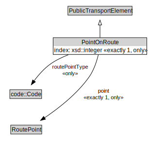

# PointOnRoute

A PointOnRoute represents an ordered RoutePoint for a PublicTransportRoute.

<a href="../../diagrams/transportnetwork__PointOnRoute.dot.svg">Open interactive PointOnRoute diagram</a>

## Formalization for PointOnRoute

| Property | Constraint |
|----------|------------|
| index | all xsd::integer |
| index | exactly 1 owl::Thing |
| point | all RoutePoint |
| point | exactly 1 owl::Thing |
| routePointType | all code::Code |
| subClassOf | PublicTransportElement |

## Used by classes

| Class | Property |
|-------|----------|
| [Public Transport Route](transportnetwork__PublicTransportRoute.md) | points |

## Other annotations

| Annotation | Value |
|------------|-------|
| xsd::pattern | PublicTransportSystemPattern |

