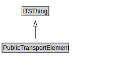

# PublicTransportElement

<a href="../../diagrams/transportnetwork__PublicTransportElement.dot.svg">Open interactive PublicTransportElement diagram</a>

## Specializations of PublicTransportElement

| Class | Description |
|-------|-------------|
| [Group Of Lines](transportnetwork__GroupOfLines.md) | A GroupOfLines is a logical grouping of PublicTransportLines for any useful purpose. |
| [Point On Route](transportnetwork__PointOnRoute.md) | A PointOnRoute represents an ordered RoutePoint for a PublicTransportRoute. |
| [Public Transport Line](transportnetwork__PublicTransportLine.md) | A PublicTransportLine is one or more routes used by public transport vehicles to transport passengers to and from designated locations. |
| [Public Transport Route](transportnetwork__PublicTransportRoute.md) | A PublicTransportRoute represents one specific path used by a public transport vehicle to transport passengers to and from designated locations. |
| [Public Transport System](transportnetwork__PublicTransportSystem.md) | A PublicTransportSystem provides transport services to members of the public. |
| [Route Point](transportnetwork__RoutePoint.md) | A RoutePoint represents a point of interest along a PublicTransportRoute. |

## Formalization for PublicTransportElement

| Property | Constraint |
|----------|------------|
| subClassOf | ITSThing |

## Other annotations

| Annotation | Value |
|------------|-------|
| xsd::pattern | PublicTransportSystemPattern |

