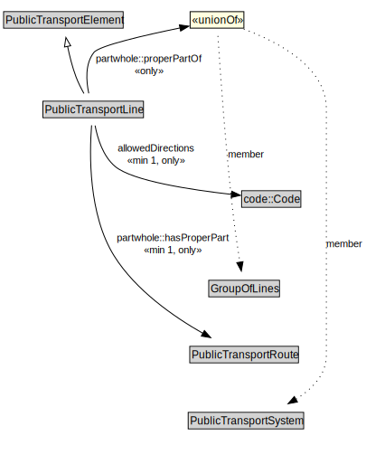

# PublicTransportLine

A PublicTransportLine is one or more routes used by public transport vehicles to transport passengers to and from designated locations.

<a href="../../diagrams/transportnetwork__PublicTransportLine.dot.svg">Open interactive PublicTransportLine diagram</a>

## Formalization for PublicTransportLine

| Property | Constraint |
|----------|------------|
| allowedDirections | all code::Code |
| allowedDirections | min 1 owl::Thing |
| partwhole::hasProperPart | all PublicTransportRoute |
| partwhole::hasProperPart | min 1 owl::Thing |
| partwhole::properPartOf | all GroupOfLines or PublicTransportSystem |
| subClassOf | PublicTransportElement |

## Used by classes

| Class | Property |
|-------|----------|
| [Group Of Lines](transportnetwork__GroupOfLines.md) | partwhole::hasProperPart |
| [Public Transport Route](transportnetwork__PublicTransportRoute.md) | partwhole::properPartOf |

## Other annotations

| Annotation | Value |
|------------|-------|
| xsd::pattern | PublicTransportSystemPattern |

