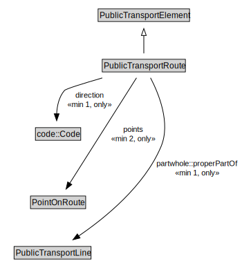

# PublicTransportRoute

A PublicTransportRoute represents one specific path used by a public transport vehicle to transport passengers to and from designated locations.

NOTE: For example, a PublicTransportLine might use an alternate PublicTransportRoute to reach its next stop during periods of congestion.

<a href="../../diagrams/transportnetwork__PublicTransportRoute.dot.svg">Open interactive PublicTransportRoute diagram</a>

## Formalization for PublicTransportRoute

| Property | Constraint |
|----------|------------|
| direction | all code::Code |
| direction | min 1 owl::Thing |
| partwhole::properPartOf | all PublicTransportLine |
| partwhole::properPartOf | min 1 owl::Thing |
| points | all PointOnRoute |
| points | min 2 owl::Thing |
| subClassOf | PublicTransportElement |

## Used by classes

| Class | Property |
|-------|----------|
| [Public Transport Line](transportnetwork__PublicTransportLine.md) | partwhole::hasProperPart |

## Other annotations

| Annotation | Value |
|------------|-------|
| xsd::pattern | PublicTransportSystemPattern |

