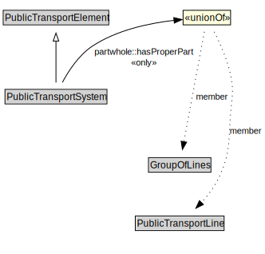

# PublicTransportSystem

A PublicTransportSystem provides transport services to members of the public.

<a href="../../diagrams/transportnetwork__PublicTransportSystem.dot.svg">Open interactive PublicTransportSystem diagram</a>

## Formalization for PublicTransportSystem

| Property | Constraint |
|----------|------------|
| partwhole::hasProperPart | all GroupOfLines or PublicTransportLine |
| subClassOf | PublicTransportElement |

## Used by classes

| Class | Property |
|-------|----------|
| [Group Of Lines](transportnetwork__GroupOfLines.md) | partwhole::properPartOf |

## Other annotations

| Annotation | Value |
|------------|-------|
| xsd::pattern | PublicTransportSystemPattern |

