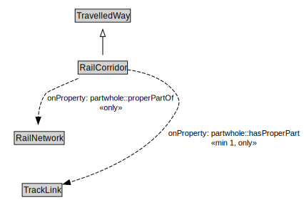

# RailCorridor

A RailCorridor is a type of TravelledWay that is made up of TrackLinks.

<a href="../../diagrams/transportnetwork__RailCorridor.dot.svg">Open interactive RailCorridor diagram</a>

## Formalization for RailCorridor

| Property | Constraint |
|----------|------------|
| partwhole::hasProperPart | all TrackLink |
| partwhole::hasProperPart | min 1 owl::Thing |
| partwhole::properPartOf | all RailNetwork |
| subClassOf | TravelledWay |

## Other annotations

| Annotation | Value |
|------------|-------|
| xsd::pattern | RailNetworkPattern |

