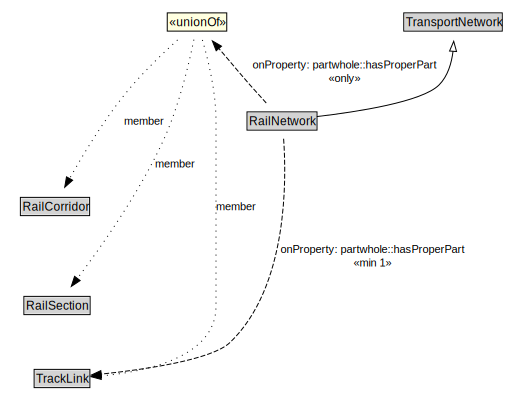

# RailNetwork

A RailNetwork is a type of TransportNetwork using rails on a stabilized base.

<a href="../../diagrams/transportnetwork__RailNetwork.dot.svg">Open interactive RailNetwork diagram</a>

## Formalization for RailNetwork

| Property | Constraint |
|----------|------------|
| partwhole::hasProperPart | all RailCorridor or RailSection or TrackLink |
| partwhole::hasProperPart | min 1 owl::Thing |
| subClassOf | TransportNetwork |

## Used by classes

| Class | Property |
|-------|----------|
| [Rail Corridor](transportnetwork__RailCorridor.md) | partwhole::properPartOf |
| [Rail Section](transportnetwork__RailSection.md) | partwhole::properPartOf |

## Other annotations

| Annotation | Value |
|------------|-------|
| xsd::pattern | RailNetworkPattern |

