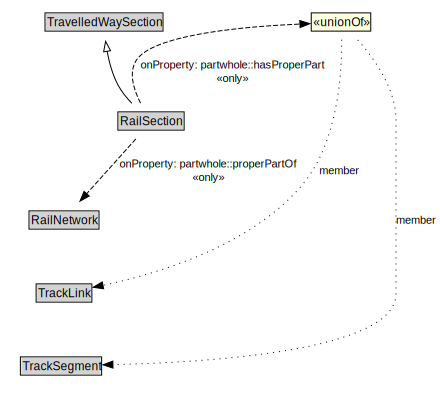

# RailSection

A RailSection is a type of TravelledWaySection that groups TrackLinks and TrackSegments for a useful operational purpose (e.g., assigning a speed limit, designating a traffic control scheme).

<a href="../../diagrams/transportnetwork__RailSection.dot.svg">Open interactive RailSection diagram</a>

## Formalization for RailSection

| Property | Constraint |
|----------|------------|
| partwhole::hasProperPart | all TrackLink or TrackSegment |
| partwhole::properPartOf | all RailNetwork |
| subClassOf | TravelledWaySection |

## Other annotations

| Annotation | Value |
|------------|-------|
| xsd::pattern | RailNetworkPattern |

