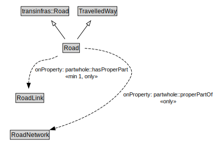

# Road

A Road is a type of TravelledWay and transinfras:Road that is made up of RoadLinks. Roads form a proper part of RoadNetworks.

<a href="../../diagrams/transportnetwork__Road.dot.svg">Open interactive Road diagram</a>

## Specializations of Road

| Class | Description |
|-------|-------------|
| [Micromobility Path](transportnetwork__MicromobilityPath.md) | A MicromobilityPath is a type of Road that is made up of MicromobilityPathLinks. |

## Formalization for Road

| Property | Constraint |
|----------|------------|
| partwhole::hasProperPart | all RoadLink |
| partwhole::hasProperPart | min 1 owl::Thing |
| partwhole::properPartOf | all RoadNetwork |
| subClassOf | TravelledWay |
| subClassOf | transinfras::Road |

## Other annotations

| Annotation | Value |
|------------|-------|
| xsd::pattern | RoadNetworkPattern |

