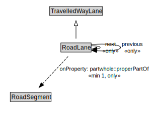

# RoadLane

A RoadLane is a type of TravelledWayLane that forms part of a RoadSegment.

<a href="../../diagrams/transportnetwork__RoadLane.dot.svg">Open interactive RoadLane diagram</a>

## Specializations of RoadLane

| Class | Description |
|-------|-------------|
| [Micromobility Lane](transportnetwork__MicromobilityLane.md) | A MicromobilityLane is a type of RoadLane that forms part of a MicromobilityPathSegment. |

## Formalization for RoadLane

| Property | Constraint |
|----------|------------|
| next | all RoadLane |
| partwhole::properPartOf | all RoadSegment |
| partwhole::properPartOf | min 1 owl::Thing |
| previous | all RoadLane |
| subClassOf | TravelledWayLane |
| width | all xsd::nonNegativeInteger |
| width | exactly 1 owl::Thing |

## Used by classes

| Class | Property |
|-------|----------|
| [Road Lane](transportnetwork__RoadLane.md) | next |
| [Road Lane](transportnetwork__RoadLane.md) | previous |
| [Road Segment](transportnetwork__RoadSegment.md) | partwhole::hasProperPart |

## Other annotations

| Annotation | Value |
|------------|-------|
| xsd::pattern | RoadNetworkPattern |

