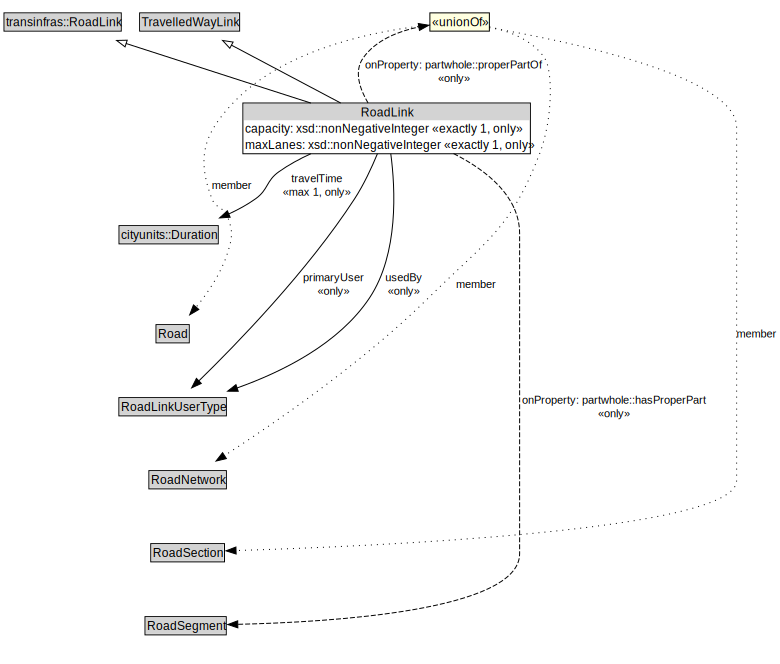

# RoadLink

A RoadLink is a type of TravelledWayLink and transinfras:RoadLink using a stabilized base designed for the movement of vehicles that conform to a specified set of requirements but may be used by others as well.

<a href="../../diagrams/transportnetwork__RoadLink.dot.svg">Open interactive RoadLink diagram</a>

## Specializations of RoadLink

| Class | Description |
|-------|-------------|
| [Micromobility Link](transportnetwork__MicromobilityLink.md) | A MicromobilityLink is a type of RoadLink designed for micromobility vehicles. |

## Formalization for RoadLink

| Property | Constraint |
|----------|------------|
| capacity | all xsd::nonNegativeInteger |
| capacity | exactly 1 owl::Thing |
| maxLanes | all xsd::nonNegativeInteger |
| maxLanes | exactly 1 owl::Thing |
| partwhole::hasProperPart | all RoadSegment |
| partwhole::properPartOf | all Road or RoadNetwork or RoadSection |
| primaryUser | all RoadLinkUserType |
| subClassOf | TravelledWayLink |
| subClassOf | transinfras::RoadLink |
| travelTime | all cityunits::Duration |
| travelTime | max 1 owl::Thing |
| usedBy | all RoadLinkUserType |

## Used by classes

| Class | Property |
|-------|----------|
| [Road](transportnetwork__Road.md) | partwhole::hasProperPart |
| [Road Link User Type](transportnetwork__RoadLinkUserType.md) | uses |

## Other annotations

| Annotation | Value |
|------------|-------|
| xsd::pattern | RoadNetworkPattern |

