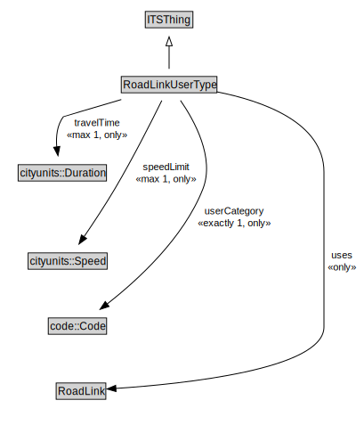

# RoadLinkUserType

A RoadLinkUserType represents the unique combination of a RoadLink and a UserType such that speed limits and other characteristics can be defined to apply to specific user types when operating along a particular road link.

<a href="../../diagrams/transportnetwork__RoadLinkUserType.dot.svg">Open interactive RoadLinkUserType diagram</a>

## Formalization for RoadLinkUserType

| Property | Constraint |
|----------|------------|
| speedLimit | all cityunits::Speed |
| speedLimit | max 1 owl::Thing |
| subClassOf | ITSThing |
| travelTime | all cityunits::Duration |
| travelTime | max 1 owl::Thing |
| userCategory | all code::Code |
| userCategory | exactly 1 owl::Thing |
| uses | all RoadLink |

## Used by classes

| Class | Property |
|-------|----------|
| [Road Link](transportnetwork__RoadLink.md) | primaryUser |
| [Road Link](transportnetwork__RoadLink.md) | usedBy |

## Other annotations

| Annotation | Value |
|------------|-------|
| xsd::pattern | RoadNetworkPattern |

