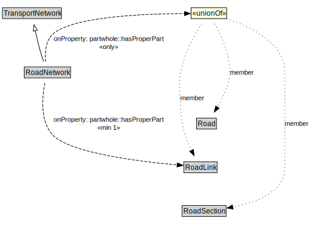

# RoadNetwork

A RoadNetwork is a type of TransportNetwork using a stabilized base designed for the movement of vehicles, other than rail or air vehicles, that conform to a specified set of requirements but may be used by others as well.

<a href="../../diagrams/transportnetwork__RoadNetwork.dot.svg">Open interactive RoadNetwork diagram</a>

## Specializations of RoadNetwork

| Class | Description |
|-------|-------------|
| [Micromobility Network](transportnetwork__MicromobilityNetwork.md) | A MicromobilityNetwork is a type of RoadNetwork designed for the use of micromobility vehicles, which have more limited performance characteristics than motor vehicles. |

## Formalization for RoadNetwork

| Property | Constraint |
|----------|------------|
| partwhole::hasProperPart | all Road or RoadLink or RoadSection |
| partwhole::hasProperPart | min 1 owl::Thing |
| subClassOf | TransportNetwork |

## Used by classes

| Class | Property |
|-------|----------|
| [Road](transportnetwork__Road.md) | partwhole::properPartOf |
| [Road Section](transportnetwork__RoadSection.md) | partwhole::properPartOf |

## Other annotations

| Annotation | Value |
|------------|-------|
| xsd::pattern | RoadNetworkPattern |

