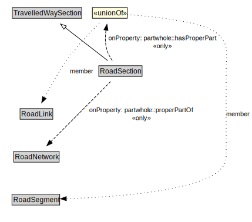

# RoadSection

A RoadSection is a type of TravelledWaySection that groups RoadLinks and RoadSegments for a useful operational purpose (e.g., assigning a speed limit, designating a traffic control scheme).

<a href="../../diagrams/transportnetwork__RoadSection.dot.svg">Open interactive RoadSection diagram</a>

## Specializations of RoadSection

| Class | Description |
|-------|-------------|
| [Micromobility Path Section](transportnetwork__MicromobilityPathSection.md) | A MicromobilityPathSections is a type of RoadSection that groups MicromobilityLinks and MicromobilityPathSegments for a useful operational purpose (e.g., assigning a speed limit, designating areas of shared use). |

## Formalization for RoadSection

| Property | Constraint |
|----------|------------|
| partwhole::hasProperPart | all RoadLink or RoadSegment |
| partwhole::properPartOf | all RoadNetwork |
| subClassOf | TravelledWaySection |

## Other annotations

| Annotation | Value |
|------------|-------|
| xsd::pattern | RoadNetworkPattern |

