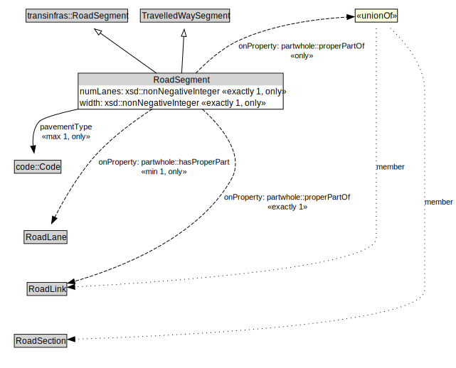

# RoadSegment

A RoadSegment is a type of TravelledWaySegment and transinfas:RoadSegment that represents a portion of a RoadLink with common physical characteristics.

<a href="../../diagrams/transportnetwork__RoadSegment.dot.svg">Open interactive RoadSegment diagram</a>

## Specializations of RoadSegment

| Class | Description |
|-------|-------------|
| [Micromobility Path Segment](transportnetwork__MicromobilityPathSegment.md) | A MicromobilityPathSegment is a type of RoadSegment that represents a portion of a MicromobilityLink with common physical characteristics. |

## Formalization for RoadSegment

| Property | Constraint |
|----------|------------|
| numLanes | all xsd::nonNegativeInteger |
| numLanes | exactly 1 owl::Thing |
| partwhole::hasProperPart | all RoadLane |
| partwhole::hasProperPart | min 1 owl::Thing |
| partwhole::properPartOf | all RoadLink or RoadSection |
| partwhole::properPartOf | exactly 1 owl::Thing |
| pavementType | all code::Code |
| pavementType | max 1 owl::Thing |
| subClassOf | TravelledWaySegment |
| subClassOf | transinfras::RoadSegment |
| width | all xsd::nonNegativeInteger |
| width | exactly 1 owl::Thing |

## Used by classes

| Class | Property |
|-------|----------|
| [Road Lane](transportnetwork__RoadLane.md) | partwhole::properPartOf |
| [Road Link](transportnetwork__RoadLink.md) | partwhole::hasProperPart |

## Other annotations

| Annotation | Value |
|------------|-------|
| xsd::pattern | RoadNetworkPattern |

