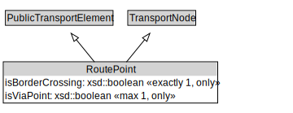

# RoutePoint

A RoutePoint represents a point of interest along a PublicTransportRoute.

<a href="../../diagrams/transportnetwork__RoutePoint.dot.svg">Open interactive RoutePoint diagram</a>

## Formalization for RoutePoint

| Property | Constraint |
|----------|------------|
| isBorderCrossing | all xsd::boolean |
| isBorderCrossing | exactly 1 owl::Thing |
| isViaPoint | all xsd::boolean |
| isViaPoint | max 1 owl::Thing |
| subClassOf | PublicTransportElement |
| subClassOf | TransportNode |

## Used by classes

| Class | Property |
|-------|----------|
| [Point On Route](transportnetwork__PointOnRoute.md) | point |

## Other annotations

| Annotation | Value |
|------------|-------|
| xsd::pattern | PublicTransportSystemPattern |

