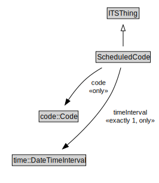

# ScheduledCode

The operational status of an entity, e.g., open or closed.

<a href="../../diagrams/transportnetwork__ScheduledCode.dot.svg">Open interactive ScheduledCode diagram</a>

## Formalization for ScheduledCode

| Property | Constraint |
|----------|------------|
| code | all code::Code |
| subClassOf | ITSThing |
| timeInterval | all time::DateTimeInterval |
| timeInterval | exactly 1 owl::Thing |

## Used by classes

| Class | Property |
|-------|----------|
| [Network Element](transportnetwork__NetworkElement.md) | status |

## Other annotations

| Annotation | Value |
|------------|-------|
| xsd::pattern | TransportNetworkPattern |

