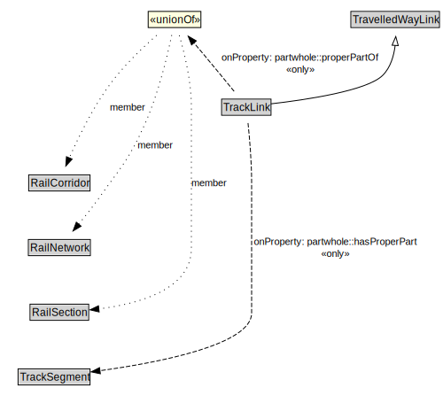

# TrackLink

A TrackLink is a type of TravelledWayLink that uses rails on a stabilized base.

<a href="../../diagrams/transportnetwork__TrackLink.dot.svg">Open interactive TrackLink diagram</a>

## Formalization for TrackLink

| Property | Constraint |
|----------|------------|
| partwhole::hasProperPart | all TrackSegment |
| partwhole::properPartOf | all RailCorridor or RailNetwork or RailSection |
| subClassOf | TravelledWayLink |

## Used by classes

| Class | Property |
|-------|----------|
| [Rail Corridor](transportnetwork__RailCorridor.md) | partwhole::hasProperPart |

## Other annotations

| Annotation | Value |
|------------|-------|
| xsd::pattern | RailNetworkPattern |

