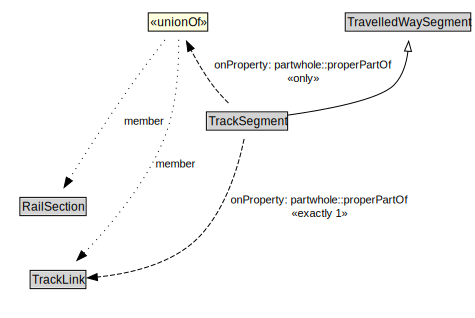

# TrackSegment

A TrackSegment is a type of TravelledWaySegment that represents a portion of a TrackLink with common physical characteristics.

<a href="../../diagrams/transportnetwork__TrackSegment.dot.svg">Open interactive TrackSegment diagram</a>

## Formalization for TrackSegment

| Property | Constraint |
|----------|------------|
| partwhole::properPartOf | all RailSection or TrackLink |
| partwhole::properPartOf | exactly 1 owl::Thing |
| subClassOf | TravelledWaySegment |

## Used by classes

| Class | Property |
|-------|----------|
| [Track Link](transportnetwork__TrackLink.md) | partwhole::hasProperPart |

## Other annotations

| Annotation | Value |
|------------|-------|
| xsd::pattern | RailNetworkPattern |

