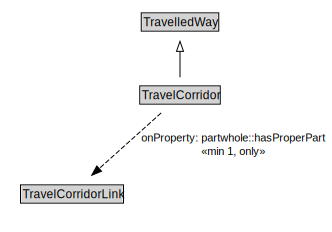

# TravelCorridor

A TravelCorridor is a type of TravelledWay that is made up of TravelCorridorLinks.

NOTE: The extent of a TravelCorridor is defined by the extent of the path that shares the designator assigned to the TravelCorridor.

<a href="../../diagrams/transportnetwork__TravelCorridor.dot.svg">Open interactive TravelCorridor diagram</a>

## Formalization for TravelCorridor

| Property | Constraint |
|----------|------------|
| partwhole::hasProperPart | all TravelCorridorLink |
| partwhole::hasProperPart | min 1 owl::Thing |
| subClassOf | TravelledWay |

## Used by classes

| Class | Property |
|-------|----------|
| [Travel Corridor Link](transportnetwork__TravelCorridorLink.md) | partwhole::properPartOf |

## Other annotations

| Annotation | Value |
|------------|-------|
| xsd::pattern | TravelCorridorPattern |

