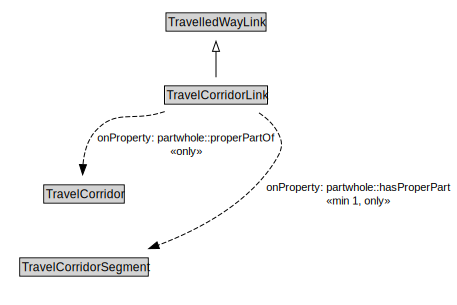

# TravelCorridorLink

A TravelCorridorLink is a type of TravelledWayLink that is made up of TravelCorridorSegments.

<a href="../../diagrams/transportnetwork__TravelCorridorLink.dot.svg">Open interactive TravelCorridorLink diagram</a>

## Formalization for TravelCorridorLink

| Property | Constraint |
|----------|------------|
| partwhole::hasProperPart | all TravelCorridorSegment |
| partwhole::hasProperPart | min 1 owl::Thing |
| partwhole::properPartOf | all TravelCorridor |
| subClassOf | TravelledWayLink |

## Used by classes

| Class | Property |
|-------|----------|
| [Travel Corridor](transportnetwork__TravelCorridor.md) | partwhole::hasProperPart |
| [Travel Corridor Segment](transportnetwork__TravelCorridorSegment.md) | partwhole::properPartOf |

## Other annotations

| Annotation | Value |
|------------|-------|
| xsd::pattern | TravelCorridorPattern |

