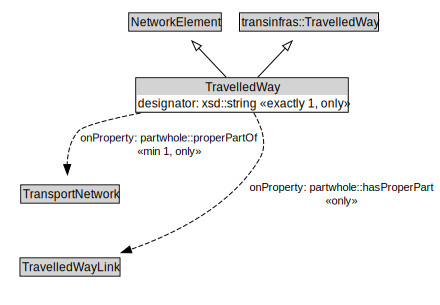

# TravelledWay

A TravelledWay is a type of NetworkElement and transinfras:TravelledWay that represents the curvilinear length of a transport route that is identified by a specific designator.

<a href="../../diagrams/transportnetwork__TravelledWay.dot.svg">Open interactive TravelledWay diagram</a>

## Specializations of TravelledWay

| Class | Description |
|-------|-------------|
| [Footpath](transportnetwork__Footpath.md) | A Footpath is a type of TravelledWay that is made up of FootpathLinks. |
| [Micromobility Path](transportnetwork__MicromobilityPath.md) | A MicromobilityPath is a type of Road that is made up of MicromobilityPathLinks. |
| [Rail Corridor](transportnetwork__RailCorridor.md) | A RailCorridor is a type of TravelledWay that is made up of TrackLinks. |
| [Road](transportnetwork__Road.md) | A Road is a type of TravelledWay and transinfras:Road that is made up of RoadLinks. Roads form a proper part of RoadNetworks. |
| [Travel Corridor](transportnetwork__TravelCorridor.md) | A TravelCorridor is a type of TravelledWay that is made up of TravelCorridorLinks. |

## Formalization for TravelledWay

| Property | Constraint |
|----------|------------|
| designator | all xsd::string |
| designator | exactly 1 owl::Thing |
| partwhole::hasProperPart | all TravelledWayLink |
| partwhole::properPartOf | all TransportNetwork |
| partwhole::properPartOf | min 1 owl::Thing |
| subClassOf | NetworkElement |
| subClassOf | transinfras::TravelledWay |

## Other annotations

| Annotation | Value |
|------------|-------|
| xsd::pattern | TransportNetworkPattern |

