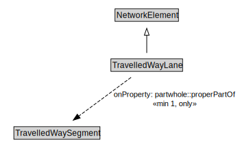

# TravelledWayLane

A TravelledWayLane is a NetworkElement that is a portion of TravelledWaySegment intended to accommodate a single line of moving material entities (e.g., vehicles) along its length.

<a href="../../diagrams/transportnetwork__TravelledWayLane.dot.svg">Open interactive TravelledWayLane diagram</a>

## Specializations of TravelledWayLane

| Class | Description |
|-------|-------------|
| [Footpath Lane](transportnetwork__FootpathLane.md) | A FootpathLane is a type of TravelledWayLane that forms part of a FootpathSegment. |
| [Micromobility Lane](transportnetwork__MicromobilityLane.md) | A MicromobilityLane is a type of RoadLane that forms part of a MicromobilityPathSegment. |
| [Road Lane](transportnetwork__RoadLane.md) | A RoadLane is a type of TravelledWayLane that forms part of a RoadSegment. |

## Formalization for TravelledWayLane

| Property | Constraint |
|----------|------------|
| partwhole::properPartOf | all TravelledWaySegment |
| partwhole::properPartOf | min 1 owl::Thing |
| subClassOf | NetworkElement |

## Used by classes

| Class | Property |
|-------|----------|
| [Travelled Way Segment](transportnetwork__TravelledWaySegment.md) | partwhole::hasProperPart |

## Other annotations

| Annotation | Value |
|------------|-------|
| xsd::pattern | TransportNetworkPattern |

